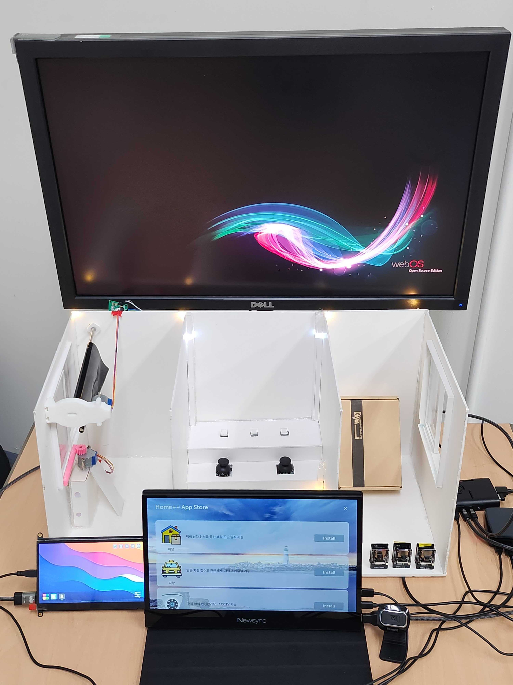

# 제 20회 임베디드 소프트웨어 경진대회 webOS부문 방파제팀

<!-- ## 개발 요약 -->

### 작품명 : Home++

- 기존 월패드의 한계를 보완하여 개발한 Home++ 월패드는 플랫폼으로, 자체 앱 스토어가 탑재돼 유연하게 앱을 다운받을 수 있으며, 운동 보조 기능과 배달 물품 조회 기능, 차량 스케줄링 기능, 가전 제어 기능, CCTV 기능을 제공한다.

 

## 기능

- <a href="https://github.com/ymw0407/2022ESWContest_webOS_3013/tree/master/main-AppStore">앱 스토어</a>
- <a href="https://github.com/ymw0407/2022ESWContest_webOS_3013/tree/master/main-Delivery">배달 도난 방지 기능</a>
- <a href="https://github.com/ymw0407/2022ESWContest_webOS_3013/tree/master/main-CCTV">CCTV 기능</a>
- <a href="https://github.com/ymw0407/2022ESWContest_webOS_3013/tree/master/main-HomeTraining/wallpad/exercise">운동 보조 기능</a>
- <a href="https://github.com/ymw0407/2022ESWContest_webOS_3013/tree/master/main-NoticeAlert">가전 제어 기능 & 게시판 기능</a>
- <a href="https://github.com/ymw0407/2022ESWContest_webOS_3013/tree/master/main-CarScheduling">차량 스케줄링 기능</a>
---
- <a href="https://github.com/ymw0407/2022ESWContest_webOS_3013/tree/master/EC2">EC2 서버</a>

 

## 개발결과물의 차별성
### 게시판 기능 추가
보통의 아파트는 방송 알림으로만 아파트 공지사항을 알려주기 때문에 방송 시간에 집에 없거나 집 내부 소리가 클 때, 방송 소리가 작으면 필요한 정보를 듣지 못하는 경우가 발생한다. 우리는 이런 상황을 고려해 우리의 작품인 월패드 안에 게시판 기능을 넣어서 아파트 내의 방송 알림을 한 번에 듣지 못하는 경우가 생겨도, 이후에 사용자가 원할 때 편리하게 공지한 내용을 확인할 수 있게 했다. 이러한 게시판 기능은 일반 게시판과 공지 게시판으로 나누어 아파트 주민들에게 공지사항을 더 편리하고 친절히 알려줄 수 있게 했고, 공지 게시판에 작성된 게시글은 작성한 예약 시간에 일괄 월패드에 알림이 뜨기 때문에 주민들은 잊지 않고 공지사항을 숙지할 수 있다. 기존 월패드의 기능적인 한계로 아파트 내에 발생하는 불편함을, 게시판 기능을 추가함으로써 해소하려고 한 점에서 기존 월패드와 개발 결과물에 차별성이 있다고 본다.
### 확장성
기존 월패드는 폐쇄적인 환경으로 기본 탑재되어 있는 기능만을 사용할 수 있었다. 그러나 우리가 개발한 제품은 앱스토어를 통하여 앱을 다운받고 활용할 수 있는 기능을 갖고 있다. 사용자 개인의 욕구에 맞게 자유롭게 앱을 추가하여 사용할 수 있는 환경을 제공함으로써, 벽에 붙어있는 단순한 월패드 개념에서 사용자의 기호에 맞게 조절이 가능한 스마트한 홈패드로 활용방안과 사용 가능성이 넓어질 것이다.

 

## 개발결과물의 파급력 및 기대효과
### 새로운 월패드의 모습 제안
이 작품은 한결 같이 벽에 붙어 같은 기능만 수행하는 정적인 기기로 인지되던 월패드를 모든 세대가 가정에 하나씩 가지고 있는 주거 환경 기반 it 기기로 재해석했다. 앱 스토어를 통해 개발자가 자유롭게 webOS 월패드 앱을 창작해 배포하고 사용자가 자신의 생활 양식에 따라 앱을 선택해 사용하는 webOS 생태계를 구축할 수 있을 것이다. 이것은 주거환경 친화적인 다양한 월패드 앱들이 개발될 환경을 조성하고, 새로운 시장을 개척할 수 있을 것이다. 그 예시로 이 작품은 영상 처리를 활용해 기존 주거 환경에서 불편했던 점을 배달 물품 도난 방지, 차량 스케쥴링을 통해 성공적으로 해결했다. 또한 사용자의 수요에 맞춰 홈 트레이닝 도우미 앱을 만들었다. 이런 기존 월패드에 없던 다양한 서비스를 제공하는 앱들은 월패드가 사용자에게 더 친숙하게 인식될 계기가 될 것이다. 사용자의 기호에 따라 유연하게 바뀔 수 있는 새로운 사용법을 제안하는 **방파제의 Home++ 월패드** 는 시장에서 충분히 활용될 수 있을 것이라 생각한다.

 

## 파일 구성도
 
📦2022ESWContest_webOS_3013  
 ┣ 📂EC2  
 ┃ ┣ 📂express_file_server  
 ┃ ┗ 📂express_server  
 ┣ 📂main-AppStore  
 ┃ ┣ 📂wallpad  
 ┃ ┃ ┗ 📂appstore  
 ┃ ┃ ┃ ┣ 📂appstore_app  
 ┃ ┃ ┃ ┗ 📂appstore_service  
 ┣ 📂main-CCTV  
 ┃ ┣ 📂outside  
 ┃ ┃ ┗ 📂arduino  
 ┃ ┃ ┃ ┗ 📂cctv  
 ┃ ┃ ┃ ┃ ┗ 📜cctv.ino  
 ┃ ┣ 📂wallpad  
 ┃ ┃ ┗ 📂cctv  
 ┃ ┃ ┃ ┗ 📂cctv_app  
 ┣ 📂main-CarScheduling  
 ┃ ┣ 📂office  
 ┃ ┃ ┣ 📂arduino  
 ┃ ┃ ┃ ┗ 📂barrier  
 ┃ ┃ ┃ ┃ ┗ 📜barrier.ino  
 ┃ ┃ ┣ 📂car-detection  
 ┃ ┃ ┃ ┣ 📂car-detection_app  
 ┃ ┃ ┃ ┣ 📂car-detection_service  
 ┃ ┃ ┣ 📂docker  
 ┃ ┃ ┃ ┗ 📂tesseract  
 ┃ ┣ 📂wallpad  
 ┃ ┃ ┣ 📂register-car  
 ┃ ┃ ┃ ┣ 📂register-car_app  
 ┃ ┃ ┃ ┗ 📂register-car_service  
 ┣ 📂main-Delivery  
 ┃ ┣ 📂entrance  
 ┃ ┃ ┗ 📂Detecting-packages  
 ┃ ┣ 📂wallpad  
 ┃ ┃ ┗ 📂delivery  
 ┃ ┃ ┃ ┣ 📂delivery_app  
 ┃ ┃ ┃ ┗ 📂delivery_service  
 ┣ 📂main-HomeTraining  
 ┃ ┗ 📂wallpad  
 ┃ ┃ ┗ 📂exercise  
 ┃ ┃ ┃ ┣ 📂exercise_app  
 ┃ ┃ ┃ ┗ 📂exercise_service  
 ┃ ┗ 📂home  
 ┃ ┃ ┃ ┣ 📂led  
 ┃ ┃ ┃ ┃ ┗ 📜led.ino  
 ┃ ┃ ┃ ┗ 📂windowBlind  
 ┃ ┃ ┃ ┃ ┗ 📜windowBlind.ino  
 ┣ 📂main-NoticeAlert  
 ┃ ┣ 📂wallpad   
 ┃ ┃ ┣ 📂control  
 ┃ ┃ ┃ ┣ 📂control_app  
 ┃ ┃ ┃ ┗ 📂control_service  
 ┃ ┃ ┗ 📂reservation  
 ┃ ┃ ┃ ┣ 📂reservation_app  
 ┃ ┃ ┃ ┗ 📂reservation_service  
 ┗ 📜README.md
  

## 팀 명단
| Profile | Role | Part | Tech Stack |
| ------- | ---- | ---- | ---------- |
| 
<a href="https://github.com/ymw0407"> <b>윤민우</b></a>
 | 팀장 | PM, Server, Service, HW, Network | NodeJS, ReactJS, Arduino, MongoDB, AWS EC2, Docker |
| 
<a href="https://github.com/seiyoon"> <b>황세윤</b></a>
 | 팀원 | UI | ReactJS |
| 
<a href="https://github.com/judyzero"> <b>유다영</b></a>
 | 팀원 | Server, DB | NodeJS, MongoDB |
| 
<a href="https://github.com/jjunh33"> <b>이준혁</b></a>
 | 팀원 | Service, HW, CV | Arduino, NodeJS, Python, Media Pipe |
| 
<a href="https://github.com/bentshrimp"> <b>박진우</b></a>
 | 팀원 | Service, UI, Server | ReactJS, EnactJS, NodeJS, Python, Yolo V5 |
