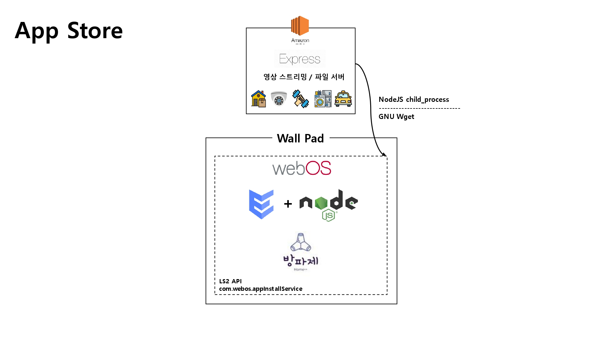

## App Store

---
### 소개
---
Open Source OS인 webOS를 활용하여 "_LG의 Smart TV_" 와 같이 아파트에 사는 모든 세대가 하나씩은 갖고 있는 월패드를 플랫폼으로 만들어 개발자가 자유롭게 만들고 배포할 수 있는 환경을 App Store 기능을 통해 구현하고자 하였다. 

Home ++ 월패드의 App Store 앱/기능은 "_배달 도난 방지 기능_", "_CCTV 기능_", "_홈 트레이닝 도우미 기능_", "_가전 제어 기능_", "_차량 출입 스케쥴링 기능_"을 어느 Home ++ 월패드에서든 설치할 수 있게 해주는 역할을 한다.  

---
### System Architecture
---

---
### 기술 소개
---
AWS EC2(클라우드 서버):
- 보안 그룹의 인바운드 규칙에서 8000포트를 개방하여 포트 포워딩을 하였다. 
     
- Express.js(영상 스트리밍 / 파일 서버)
    - Express 서버에서 apps로 라우팅을 하여, 파일에 접근할 수 있게 하였다.
    - wget을 통해 Express 서버에 get 요청을 하는 구조이기 때문에, get method에 respose의 download method를 사용하여 구현할 수 있었다. 
    <!-- 진우가 한번 보고 첨삭해줘요. -->
     

 webOS(월패드):
    <!-- - ENACT(com.appstore.app)
        - 쓸거 있으면 진우가 써줘요.    -->

- Node.JS(com.appstore.app.service)
    - Node.js의 내장 모듈 중 하나인 child process의 execSync method를 사용하여 GNU의 wget 명령을 실행시켜, 앱들의 IPK를 AWS EC2의 영상 스트리밍 / 파일 서버로부터 가져왔다.
    - __com.webos.appInstallService__ 의 install method와 remove method를 통해서 설치, 삭제 기능을 구현할 수 있었다.
    - 추후, 복잡한 앱들의 초기 설정을 IPK 설치와 함께하게 개선하고자 한다.(ex. docker 설정, 파일 권한 설정 등)
---
### 장애 요인
---
1. 기존에는 IPK 파일을 앱, 서비스와 함께 패키징하여 올리고자 하였으나, IPK파일은 함께 패키징 되지 않는다.  -> 외부 서버인 EC2의 Express 서버에 파일 서버를 함께 두어 wget을 통해 IPK 파일을 가져올 수 있게 하였다.
---