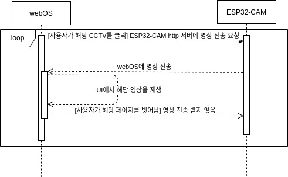

# CCTV 기능
## 기능 설명
<a href="https://github.com/webOS-KOSS/entrance_cam/issues/2">이슈 참조</a><br/>
~~Raspbian OS에 연결된 V4L2 지원 카메라에 UV4L로 WebRTC 프로토콜 라이브 스트리밍을 하여 월패드에서 현관, 놀이터, 주차장의 CCTV를 모니터링 할 수 있게 한다.~~ <br/>
<br/>
<a href="https://github.com/webOS-KOSS/CCTV/issues/1">이슈 참조</a><br/>
ESP32-CAM을 사용하여 web server에 영상을 스트리밍하고, 해당 영상을 html의 src태그를 통해서 스트리밍하여 월패드에서 현관, 놀이터, 주차장의 CCTV를 모니터링할 수 있게 한다. <br/>
<br/>
~~ESP32-CAM을 사용하여 media server에 영상을 스트리밍하고, media server에서 재공급해주는 영상을 통해서 월패드(webOS)의 웹앱에서 현관, 놀이터, 주차장의 CCTV를 모니터링할 수 있게 한다.~~ 

## 파일 구조
### CCTV_ENACT_APP
<li>Deivce : Raspberry Pi 4 webOS wallpad </li>
<li>Type : webOS's Enact App </li>
<li>App_id : com.cctv.app </li>
<li>App_name : CCTV </li>
<br/>

__개인별 수정할 부분__ : ESP32-CAM의 Ip Address를 CCTV_ENACT_APP/src/views/CCTV의 Frontdoor.js, Parking.js, Playground.js 이 세 개의 파일에서 <br />

```javascript
  
```
해당 부분의 IP를 ESP32-CAM의 IP와 맞게 수정하시면 됩니다.
<br/>

__Enact 환경 설정__ : <a href="https://github.com/webOS-KOSS/main-setting/blob/main/webOS/Enact.md">Enact 환경 설정</a>

---

### Arduino_CCTV
<li>Device : Arduino ESP32-CAM 현관, 주차장, 놀이터 </li>
<li>Type : Arduino AI Thinker ESP32-CAM </li>
<br/>

__ESP32-CAM 환경 설정__ : <a href="https://github.com/webOS-KOSS/main-setting/blob/main/Arduino/ESP32-CAM.md">ESP32-CAM 환경 설정</a>

---

### IPK
Description : ENACT app의 ipk 파일을 제공합니다.

```bash
ares-install com.cctv.app_1.0.0_all.ipk
```
## 진행 상황

- [X] ESP32-CAM 영상 스트리밍
- [ ] ~~media server 제작~~
- [X] webOS 웹앱(CCTV 모니터링)
---
- [X] 최종 구현(연계)

## 구성도


