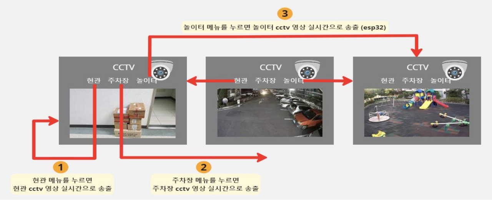
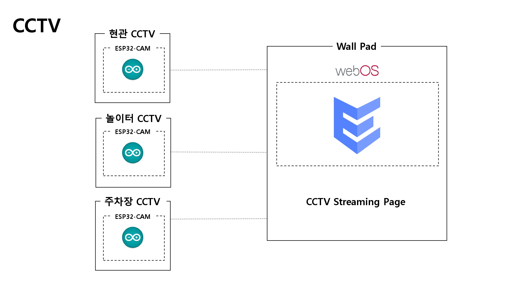
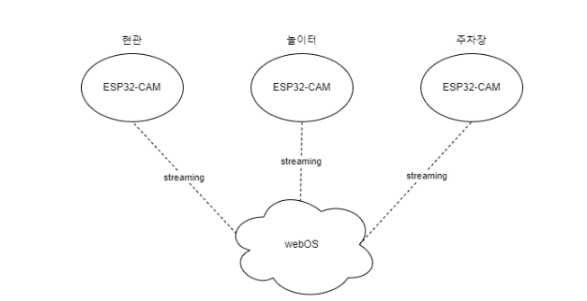

# CCTV

<br>

## 소개

ESP32-CAM을 활용하여 현관, 주차장, 놀이터 등 다양한 곳을 한 번에 확인할 수 있게 한다.<br><br>

## System Architecture


<br><br>

## Flow Chart


<br><br>

## 기술 소개

ESP32-CAM(현관, 주차장, 놀이터 CCTV)
- Arduino
    - client가 ESP32-CAM의 HTTP 서버에 접근하면, 영상을 전송해준다.
    - 추후, media서버를 EC2 서버에 만들어서, 1:1 접근 뿐만이 아니라 1:n 접근 또한 가능하게 개선할 것이다. <br><br>

webOS(월패드):
- ENACT(com.cctv.app)
    - 라우팅을 통해서 현관, 놀이터, 주차장 CCTV 페이지를 나누었다. <br><br>

## 개발환경 및 개발언어
- 운영체제 : Windows 11, Ubuntu 20.04.5 LTS, webOS 2.18.0
- 디바이스 구성 : AI-Thinker ESP32-CAM, Raspberry Pi 4B
- IDE : Visual Studio Code, Arduino IDE
- 개발 언어 : Arduino, ENACT, REACT
- package manager : npm, yarn

<a href="https://github.com/webOS-KOSS/main-setting/blob/main/Arduino/ESP32-CAM.md">ESP32-CAM Setting</a>
<br><br>

## Customize
ssid에 2.4GHz의 wifi의 이름을, password에는 wifi의 비번을 각각 자신의 것으로 바꿔주면 됩니다. <a href="https://github.com/ymw0407/2022ESWContest_webOS_3013/blob/master/main-CCTV/outside/arduino/cctv/cctv.ino">링크</a>

```C++
const char* ssid = "wifi"; // wifi SSID
const char* password = "12345678"; // wifi password
```
<br>
각각의 ESP32-CAM에 할당된 IP들을 조회하여 바꿔줍니다. <a href="https://github.com/ymw0407/2022ESWContest_webOS_3013/tree/master/main-CCTV/wallpad/cctv/cctv_app/src/views/CCTV">링크</a>

```JavaScript
var ip = "192.168.1.28";
```
<br>

## Quick Start
ares-setup-device에서 default를 자신이 설치할 webOS의 IP로 설정하세요.
```bash
source wallpad.setup.sh
```
각각의 ESP32-CAM에 cctv.ino를 업로드 하세요.
<br><br>

## 장애 요인
1. 기존에는 Raspbian OS를 사용하기로 하였으나, CCTV에 많은 기능이 들어가는 것이 아니기 때문에 효율의 측면에서 ESP32-CAM을 사용하기로 했다. <a href="https://github.com/webOS-KOSS/entrance_cam/issues/2"><이슈 참조></a>
2. ESP32-CAM에서는 한 명의 client만을 받을 수 있게 되어있다. 하지만 ESP32-CAM이라는 하드웨어의 문제가 있기 때문에, 이를 해결하고 1:n의 client를 받을 수 있게 하려면 외부에 media 서버를 두어야 된다. 추후에 추가하기로 하였다. <a href="https://github.com/webOS-KOSS/CCTV/issues/1"><이슈 참조></a><br/><br/>
