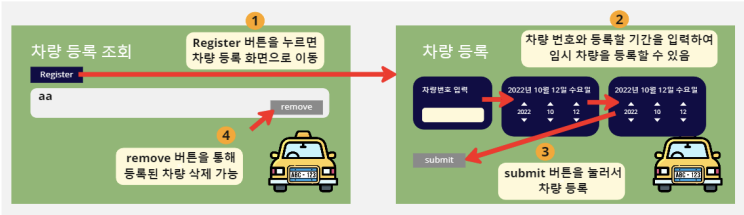
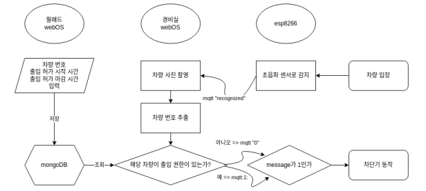
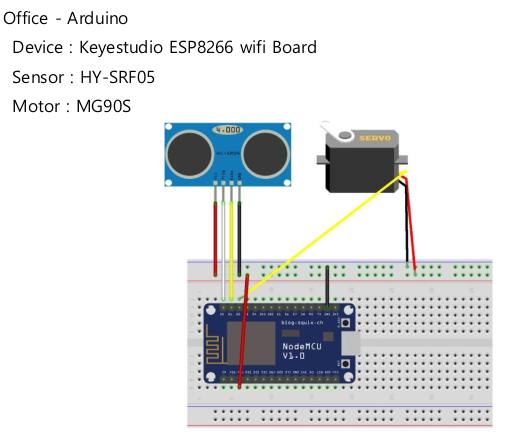

# Car Scheduling 

<br>

## 소개

대다수의 아파트에서는 외부 차량의 출입을 막고 있다. 그래서 장기간 집에 손님이 묵을 때는 관리실에서 외부 차량 등록을 해서 외부 차량이 아파트 단지에 들어올 수 있다. 관리실에 가야 차량 등록이 가능한 번거로움을 집에 있는 월패드를 통해 해결할 수 있을 것이라고 생각했다. 월패드를 통해 집에서 방문차량을 등록할 수 있다면 주기적으로 자신의 집에 방문하는 차량을 관리하는데 유용할 것이며, 매번 관리실과 연락하는 불편함을 줄일 수 있을 것이다. <br>

월패드용 차량 등록 앱을 통해서는 어떤 차량을 언제부터 언제까지 임시 등록을 할지 결정할 수 있으며, 경비실용 차량 로그 앱을 통해서는 어떤 차량이 언제, 어떤 상태로 통과를 했는지 못했는지를 조회할 수 있게 만들었다.<br><br>


## System Architecture


<br><br>

## Flow Chart


<br><br>

## 기술 소개

AWS EC2(클라우드 서버):
- 보안 그룹의 인바운드 규칙에서 각각 27017포트와 8080포트를 개방하여 포트 포워딩을 하여 MongoDB서버와 express 서버(임시등록 만료일 관리)에 접근할 수 있게 하였다.<br><br>
- Express.js(아파트 게시판 서버 中 car_expire 및 index)
    - 아파트 게시판 서버에서 사용된 express 코드에 node-schedule이라는 모듈을 사용하여 1분 주기마다 mongoose를 통해 MongoDB의 cars collection에서 expireAt을 감시하다가, expireAt이 현재 시간을 넘어서면, 삭제하게 하였다.<br><br>
- MongoDB(아파트 게시판 및 차량 등록 데이터베이스)
    - 기존에는 MongoDB Atlas를 사용하고자 하였으나, 문제가 발견되어 AWS EC2서버에 MongoDB 서버를 직접 구축하여 사용하게 되었다.<br><br>

webOS(월패드):
- ENACT(com.registercar.app)
    - React의 useEffect를 통해서 MainPanle이 처음 렌더링될 때, mainInit 서비스를 call하여 현재 등록되어있는 차량들을 가져올 수 있게 하였다.
    - RegisterPanel의 경우 Enact의 Button, Input, Datepicker를 활용하여 만들었고, 만약에 임시차량을 등록할 때, 시작 날짜가 끝 날짜보다 작다는 것은 유효하지 않다고 판단하여 해당 데이터는 제출되지 않고, toast알림과 tts알림을 통해 반려한다.
    - 현재 Remove 버튼을 누르면 데이터베이스 상에는 지워졌지만, UI에는 그대로 남아있는데 해당 부분은 추후에 수정할 예정이다.
    <br><br>
    <!-- 진우가 한번 보고 첨삭해줘요. -->
- Node.JS(com.registercar.app.service)
    - mainInit service: MongoDB서버와 연결하고, 스키마를 설정하고, MongoDB의 데이터를 가져와서 mainPanel에 보여준 뒤 MongoDB와의 연결을 끊는다. 스키마와 같은 경우에는 딱 한 번만 설정해야되기 때문에, Car라는 스키마가 정의가 되었는지를 확인하는 과정을 거친다.
    - registerCar service: MongoDB와 연결하고, MongoDB에 데이터를 저장하고, Toast와 TTS 알림을 보내는 과정을 거친 뒤 MongoDB와의 연결을 끊는다.
    - deleteCar service: MongoDB와 연결하고, 앱으로부터 넘겨받은 데이터를 기반으로 임시 등록된 차량의 데이터를 지운고, MongoDB와의 연결을 끊는다.
<br><br>

webOS(경비실):
- ENACT(com.cardetection.app)
    - MainPanle에서는 init service를 promise로 구성하여, DB8의 putPermission을 먼저 실행시켜 DB8에 대한 권한을 부여받았고, 그 다음에 async-await을 통해 비동기로 실행시켜 subscribe 옵션을 포함한 loop service를 실행시켜 서비스로부터 계속 데이터를 받아 log를 실시간으로 반영할 수 있었다.
    - 그렇게 받은 데이터들을 findHandler를 통해 parsing하여 log에 표기하였다. <br><br>

- Node.JS(com.cardetection.app.service)
    - __com.webos.service.db__ 의 LS2 API들을 활용하여 DB8을 사용할 수 있었다.
    - init service: putKind -> putPermission -> find의 과정을 거쳐 DB8에 대한 접근 권한 및 초기 데이터들을 가져와 앱에 전달한다.
    - loop service: 아두이노로부터 차량이 도착했다는 사실을 전달 받기 위해 __car/detect__ topic을, docker 내부에서 돌아갈 tesseract로부터 도착한 차량에 대한 정보를 전달 받기 위해 __car/data__ topic을 각각 subscribe하며, 차량이 도착하면 차량의 번호판을 찍기 위해 luna_service의 __com.webos.service.camera2__ LS2 API를 사용한 CameraReady(open -> setFormat -> startPreview)를 실행시켜준다. 또한 내부에서 돌아갈 docker의 초기 설정을 childProcess 모듈을 통해 해준다.<br>
    그리고 차량이 도착하여 __car/detect__ topic에 데이터가 들어오면, 촬영을 시작하고, 촬영한 사진을 미리 설정해둔 docker container의 공유 볼륨에 저장하고, nodeJS의 내장모듈인 childProcess를 사용하여 docker container 내부의 차량 번호판 분석 python 코드를 실행시킨다.<br>
    그렇게 하여 tesseract에서 분석된 데이터를 __car/data__ topic을 통해 전달받아 DB8에 저장하고, toast알림과 tts알림을 내보낸다.<br><br>

- Docker(container: tesseract)
    - tesseract의 환경 설정을 해놓은 yun1211/tesseract 이미지를 가져온다.
    - 명령어를 주지 않아도 컨테이너가 종료 되지 않게 sleep infinity 옵션을 주고, webOS의 /media/images 경로와 docker 내부의 /root/images를 공유 볼륨으로 설정하여 차량 번호판 사진을 넘길 수 있게 설정하였다. <br><br>

    - Tesseract(tesseract)
        - 차량 번호판 사진을 argparse 모듈을 통해 전달 받은 파라미터를 통해 접근하여, Tesseract OCR을 통해 분석하여 String 값을 얻어낸다.
        - 그렇게 전달받은 차량 번호을 pymongo 모듈을 통해 EC2의 MongoDB에 접근하여 데이터를 비교하여, 비교한 데이터를 MQTT의 __car/data__ topic으로 publish하여 com.cardetection.app에 전달하고, MQTT의 __car/compre__ topic으로는 등록된 차량인지 아닌지에 대한 단편적인 정보를 차량차단기 아두이노에 보내준다.

Arduino(차량 차단기):
- barrier.ino
    - 차량이 도착하기 전까지 DET case에서 초음파 센서를 사용하고 있다가 초음파 센서에 차량이 감지되면 __car/detect__ topic에 "recognized"라는 message를 보내고, REC case에 들어가 __car/compare__ topic을 subscribe 하고, docker Tesseract로부터 등록된 차량인지 아닌지에 대한 데이터가 들어오면, 각각 CORRECT, INCORRECT case로 들어갔다가 다시 DET case로 돌아간다. 만약 CORRECT case에 들어간다면 서보모터를 움직여 차량 차단기를 열어준다. <br><br>

## 개발환경 및 개발언어
- 운영체제 : Windows 11, Ubuntu 20.04.5 LTS, webOS 2.18.0
- 디바이스 구성 : Raspberry Pi 4B, KEYESTUDIO ESP8266
- IDE : Visual Studio Code, Arduino IDE
- 개발 언어 : ENACT, Node.JS, Arduino, Python
- 데이터베이스 : MongoDB
- package manager : npm
- Docker 20.10.8 - Ubuntu 20.04.5 LTS
<br><br>


<a href="https://github.com/webOS-KOSS/main-setting/blob/main/Arduino/ESP8266.md">ESP8266 Setting</a>
<br><br>

## Customize
ssid에 2.4GHz의 wifi의 이름을, password에는 wifi의 비번을 각각 자신의 것으로 바꿔주면 됩니다. <a href="https://github.com/ymw0407/2022ESWContest_webOS_3013/blob/master/main-CarScheduling/office/arduino/barrier/barrier.ino">링크</a>

```C++
const char* ssid = "wifi"; // wifi SSID
const char* password = "12345678"; // wifi password
```
<br>

## Quick Start
ares-setup-device에서 default를 자신이 설치할 webOS(월패드)의 IP로 설정하세요.
```bash
source wallpad.setup.sh
```

ares-setup-device에서 default를 자신이 설치할 webOS(경비실)의 IP로 설정하세요.
```bash
source office.setup.sh
```

차량 차단기 아두이노에 barrier.ino를 업로드 하세요.
<br><br>

## 장애 요인
1. webOS에는 Tesseract OCR이 설치 되지 않는다는 장애가 있었다. <br>
-> Docker로 container를 만들어 Tesseract OCR을 설치하여 사용할 수 있었다.

