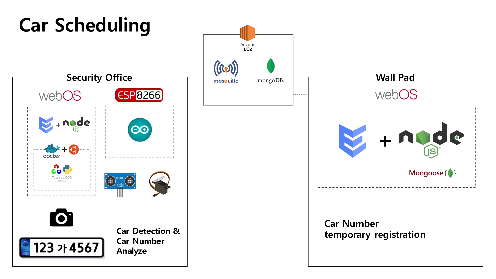

# main-CarScheduling
5. 차량 출입 스케쥴링 기능

## 파일 구조도

📦main-CarScheduling  
 ┣ 📂office  
 ┃ ┣ 📂arduino  
 ┃ ┃ ┗ 📂barrier  
 ┃ ┃ ┃ ┗ 📜barrier.ino  
 ┃ ┗ 📂car-detection  
 ┃ ┃ ┣ 📂car-detection_app  
 ┃ ┃ ┗ 📂car-detection_service  
 ┃ ┗ 📜office.setup.sh  
 ┣ 📂wallpad  
 ┃ ┗ 📂register-car  
 ┃ ┃ ┣ 📂register-car_app  
 ┃ ┃ ┗ 📂register-car_service  
 ┃ ┗ 📜wallpad.setup.sh  
 ┣ 📜.gitignore  
 ┗ 📜README.md  

## System Architecture

## Quick Start
### 📂office
- 📂arduino 
###### &nbsp;&nbsp;&nbsp;&nbsp;&nbsp;&nbsp;&nbsp;&nbsp;<a href="https://github.com/webOS-KOSS/main-setting/blob/main/Arduino/ESP8266.md">ESP8266 환경 설정</a> -> <a href="https://github.com/webOS-KOSS/main-setting/blob/main/Arduino/CarBarrier.md">차량 차단기 하드웨어 설정</a> -> 📜barrier.ino 업로드
- 📂car-detection 
###### &nbsp;&nbsp;&nbsp;&nbsp;&nbsp;&nbsp;&nbsp;&nbsp;<a href="https://github.com/webOS-KOSS/main-setting/blob/main/webOS/docker.md">docker 설정</a> -> 📂car-detection_app & 📂car-detection_service <a href="https://github.com/webOS-KOSS/main-setting/blob/main/webOS/EnactService.md">앱 설치</a> or `source 📜office.setup.sh` 를 통해 설치

### 📂wallpad
- 📂register-car  
###### &nbsp;&nbsp;&nbsp;&nbsp;&nbsp;&nbsp;&nbsp;&nbsp;📂register-car_app & 📂register-car_service <a href="https://github.com/webOS-KOSS/main-setting/blob/main/webOS/EnactService.md">앱 설치</a> or `source 📜wallpad.setup.sh` 를 통해 설치
