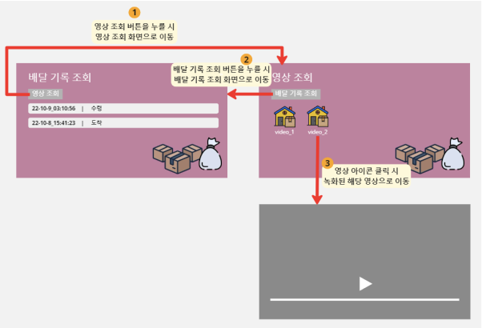
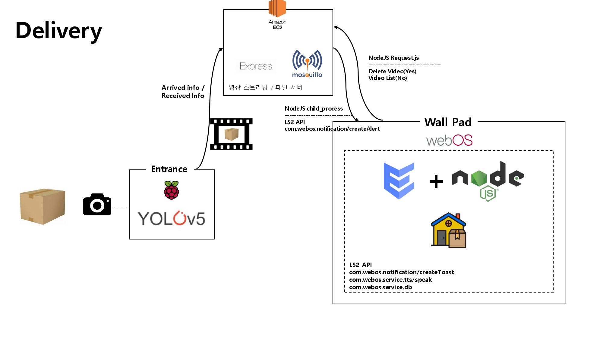
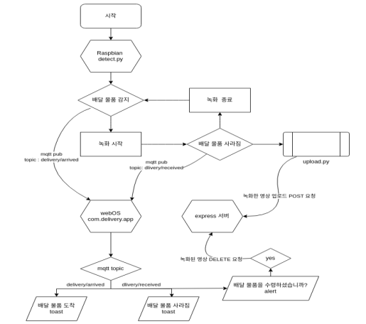

# Delivery

<br>

## 소개

팬데믹 이후 현관 앞에 택배를 놓고 가는 비대면 배달 서비스가 일상화 되면서, 도난에
취약한 택배 분실물이 점차 증가하고 있지만, 누가 언제 훔쳐갔는지 정확한 시간을
특정하지 못해 분실된 택배를 찾지 못하는 경우가 종종 발생한다. 이러한 불편함을
해소하기 위해서 월패드와 연동되는 현관 카메라를 이용하여 택배가 온 것을 확인하고
실시간으로 알람을 보내 거주자에게 알려준다면 택배 분실에 대한 걱정과 택배 도난
위험을 해소시킬 것이다.<br>

Home ++ 월패드의 배달 도난 방지 기능은 현관 캠을 통해 택배가 인지되면, 알림을 보내주고, 녹화를 시작한다. 그러다가, 택배가 사라지면 Alert 알림을 보내어 본인이 수령하였는지 확인하고, 본인이 수령한 것이 맞다면, 영상을 삭제하고 아니라면 영상을 조회할 수 있게 하여 택배 도난의 경위를 쉽게 파악할 수 있게 한다. <br><br>


## System Architecture


<br><br>

## Flow Chart


<br><br>

## 기술 소개

AWS EC2(클라우드 서버):
- 보안 그룹의 인바운드 규칙에서 8000포트를 개방하여 포트 포워딩을 하였다. <br><br>
- Express.js(영상 스트리밍 / 파일 서버)
    - Express 서버에서 apps로 라우팅을 하여, 파일에 접근할 수 있게 하였다.
    - Request.JS 모듈을 통해 월패드에 영상 리스트들을 전송하고, 삭제할 수 있게 만들어 주었다.
    <!-- 진우가 한번 보고 첨삭해줘요. -->
<br>

webOS(월패드):
- ENACT(com.delivery.app)
    - LogPanel에서는 택배가 몇시에 도착했고, 몇시에 수령을 했는지 DB8을 조회하는 서비스와 연동하여 실시간으로 확인할 수 있게 만들었다.
    - VidoePanel에서는 enact의 Changable을 사용하여 서비스에서 받아온 video list를 기반으로 실시간으로 영상 리스트들이 반영되게 만들어주었다.<br><br>
    <!-- 진우가 한번 보고 첨삭해줘요. -->
- Node.JS(com.delivery.app.service)
    - __com.webos.service.db__ 의 LS2 API들을 활용하여 DB8을 사용할 수 있었다.
    - init service: putKind -> putPermission -> find의 과정을 거쳐 DB8에 대한 접근 권한 및 초기 데이터들을 가져와 앱에 전달한다.
    - getVids service: node Module 중에 하나인 Request.js를 사용하여 EC2에 올라가있는 영상 스트리밍 / 파일 서버에 GET Method를 통해 Body를 parse하여 video의 list를 확보하여, Enact에 보내 UI에 어떤 영상이 존재하는지 반영되게 만들었다.
    - delVid service: node Module 중에 하나인 Request.js를 사용하여 EC2에 올라가있는 영상 스트리밍 / 파일 서버에 delete Method를 통해 영상을 지우도록 하였다.
    - loop service: __delivery/arrived__ topic과 __delivery/received__ topic을 subscribe하여 현관의 Raspbian으로부터 택배가 인지되고, 사라졌다는 데이터를 받아와서 __com.webos.service.tts/speak__ 와 __com.webos.notification/createToast__ 알림을 통해 월패드에 표기해줌과 동시에 DB8에 데이터를 Put하여 Log에 띄울 수 있는 환경을 마련하였다. 특히, __delivery/received__ topic에 수령 시간 데이터를 가져와 __com.webos.notification/createAlert__ 를 내장 node module 중 하나인 Child Process를 사용하여 Yes와 No를 선택할 수 있게 하였다. 만약 Yes를 선택한다면 delVid service가 실행되고, No를 선택한다면 getVids service가 실행되도록 하였다.
<br>

Raspbian OS(현관):
- Python(Yolo V5)
    - 추후에 설명이 추가될 것입니다.
<br><br>

## 개발환경 및 개발언어
- 운영체제 : Windows 11, Ubuntu 20.04.5 LTS, webOS 2.18.0, Raspbian OS
- 디바이스 구성 : Raspberry Pi 4B 2EA
- IDE : Visual Studio Code
- 개발 언어 : ENACT, Node.JS, Python
- package manager : npm, requirements.txt(python)
<br><br>

<!-- ## Customize

<br> -->

## Quick Start
ares-setup-device에서 default를 자신이 설치할 webOS의 IP로 설정하세요.
```bash
source wallpad.setup.sh
```
<br>

## 장애 요인

1. LS2 API 중에서 __com.webos.notification/createAlert__ API는 3rd party앱에서의 접근을 허가하지 않는 문제가 있었다.<br> 
--> 해당 문제를 해결하기 위해서 node의 내장 모듈 중 하나인 Child Process를 사용하여 직접적으로 webOS에 명령을 내리는 방식으로 우회하여 createAlert API를 사용할 수 있었다.
2. local에 있는 영상이 Enact에서 접근이 되지 않는 문제가 있었다. <br>
--> 해당 문제를 해결하기 위해, 영상 스트리밍 서버를 EC2에 만들어서 사용해서 외부의 영상을 URL을 통하여 접근할 수 있게 하였다.