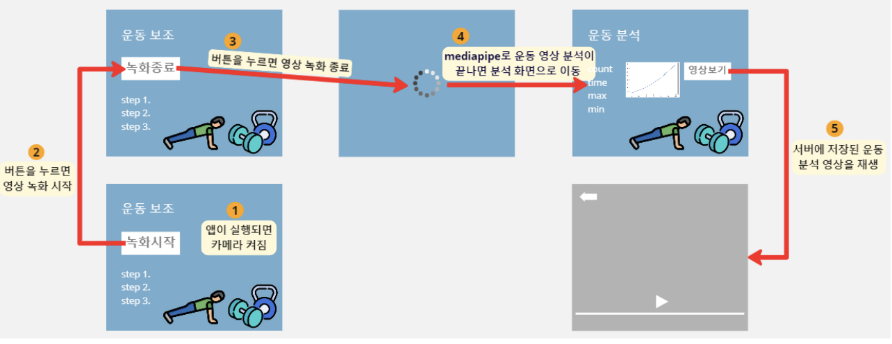
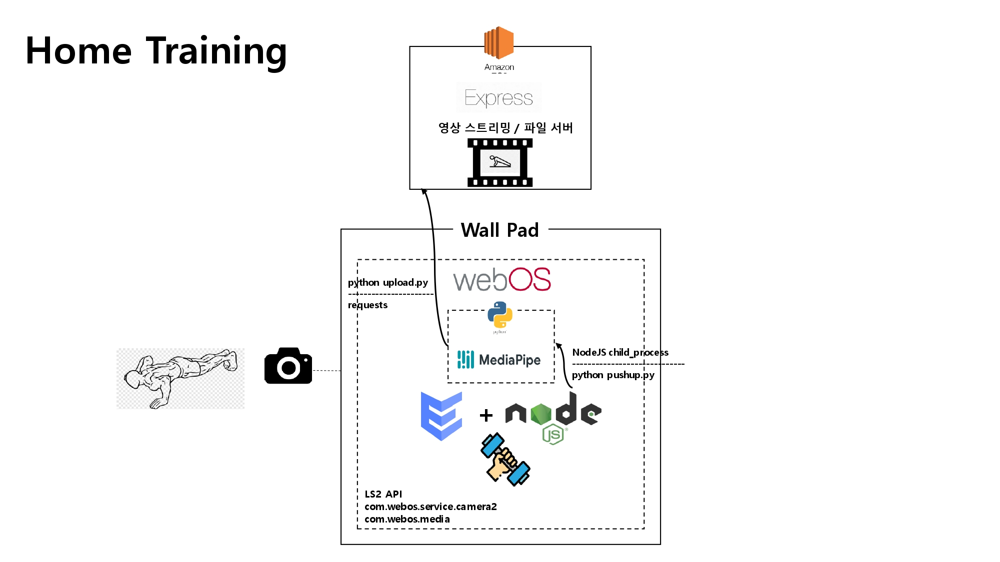
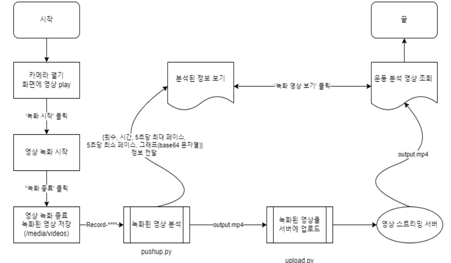

# Home Training

<br>

## 소개

팬데믹 이후 ‘홈트족’ 이라는 말이 생길 만큼 집에서 운동하는 사람들이 증가하였다. 하지만 집에서 운동을 하다보면 의지가 부족해 운동을 금새 그만두거나, 자신이 올바른 자세로 하고 있는지 모르는 경우가 많아, 오히려 자세가 트러지는 등 부작요이 있기도 하다. 운동하는 자세를 보여주면서 운동 횟수를 세주고, 운동 자세를 분석해주는 앱이 있다면 집에서 혼자 운동을 하는 데 편리할 것이며, Home++ 월패드라는 플랫폼에서 개발자들이 나아가야할 방향에 대해서 이야기해준다.<br>

Home ++ 월패드의 운동 보조 기능은 사용ㅈ자가 녹화 시작을 누르면, 2번째 모니터에서 자신의 운동모습을 보여줌과 동시에 녹화를 시작하고 운동이 끝나고 녹화종료를 누르게 되면 운동 분석이 시작된다. 운동 분석이 끝나게 되면(오래 걸림) 운동을 어느 정도의 속도로 진행하였는지에 대한 분석 그래프와 운동 시간, 횟수, 소모 칼로리 등 다양한 정보를 제공한다. 이후 영상보기를 통해 어떤 자세가 잘못되었는지 확인할 수 있게 하였다.<br><br>

## System Architecture


<br><br>

## Flow Chart


<br><br>

## 기술 소개

AWS EC2(클라우드 서버):
- 보안 그룹의 인바운드 규칙에서 8000포트를 개방하여 포트 포워딩을 하였다. <br><br>
- Express.js(영상 스트리밍 / 파일 서버)
    - Express 서버에서 exercise로 routing하여 파일을 POST, GET을 할 수 있게 하여 ENACT에서 영상에 접근할 수 있게 하였다.
    - Request.JS 모듈을 통해 운동 분석 영상을 전송할 수 있게 하였다.
    - 영상을 webOS에 맞는 코덱(libx264)으로 변경해주는 ffmpeg 모듈을 사용하였다. 
    <!-- 진우가 한번 보고 첨삭해줘요. -->
<br>

webOS(월패드):
- ENACT(com.exercise.app)
    - enact의 VideoPlayer를 사용하여 비디오를 재생할 수 있게 하였다.
    - First panel에서는 useEffect를 통해 시작하자마자 serviceStart를 통해 카메라 환경 설정 및 스트리밍 환경설정을 한다. <br><br>
    <!-- 진우가 한번 보고 첨삭해줘요. -->
- Node.JS(com.exercise.app.service)
    - serviceStart service: NodeJS의 기본 모듈 중 하나인 Child Process를 사용하여 __/usr/sbin/camera_window_manager_exporter__ 를 통해 2번째 모니터에 스트리밍 영역을 지정해준다. 또한 __com.webos.service.camera2__ API와 __com.webos.media__ 를 사용하여 open -> setFormat -> startPreview -> load -> play의 과정을 거쳐 카메라 세팅을 완료한다.
    - record service: __com.webos.media/startCamerRecord__ 를 통해 녹화를 시작한다.
    - child service: __com.webos.service.camera2__ API와 __com.webos.media__ 를 사용하여 stopCameraRecord -> unload -> stopPreview -> close를 통해 녹화와 스트리밍, 카메라를 종료한다. 그리고 NodeJS의 기본 모듈 중 하나인 Child Process를 사용하여 python 운동 분석을 시작한다. 운동 분석이 끝나면 python에서 출력된 JSON을 Parsing하여 데이터를 표기해준다. 또한 Base64로 전달된 그래프를 가져와서 enact에 전달해 사용한다.
    <br><br>

- Python(Media Pipe)
    - pushup.py에서는 Media Pipe를 사용하여 운동 분석을 하고, 운동 분석을 한 결과를 Matplotlib으로 그래프를 만들어 base64로 인코딩한 후, 데이터를 json의 형식으로 출력하여 webOS에서 값을 parsing할 수 있게 한다.
    - upload.py에서는 영상을 AWS EC2에 requests 모듈을 사용하여 POST한다.
<br><br>

## 개발환경 및 개발언어
- 운영체제 : Windows 11, Ubuntu 20.04.5 LTS, webOS 2.18.0
- 디바이스 구성 : Raspberry Pi 4B
- IDE : Visual Studio Code
- 개발 언어 : ENACT, Node.JS, Python
- package manager : npm, yarn
<br><br>

<!-- ## Customize

<br> -->

## Quick Start
ares-setup-device에서 default를 자신이 설치할 webOS의 IP로 설정하세요.
```bash
source wallpad.setup.sh
```
<br>

## 장애 요인

1. MediaPipe 에서 사용하는 tensorflow API 는 webassembly(WASM)으로 구현되어 있는데, webOS OSE 는 WASM 을 지원하지 않기 때문에 MediaPipe JavaScript Solution이 동작하지 않는다.<br> 
--> 운동 분석 서비스 디렉토리 안에 python 으로 mediapipe 를 이용한 운동 분석을 구현하고, node.js 의 child_processs 모듈을 이용해 service 단에서 python 파일을 실행시켜 그 결과 값을 JSON 의 형태로 받아와서 사용하는 방식으로 해결하였다.<br><br>
2. local에 있는 영상이 Enact에서 접근이 되지 않는 문제가 있었다. <br>
--> 해당 문제를 해결하기 위해, 영상 스트리밍 서버를 EC2에 만들어서 사용해서 외부의 영상을 URL을 통하여 접근할 수 있게 하였다.