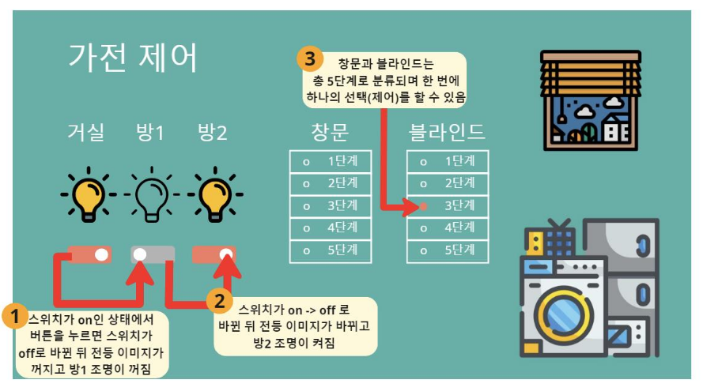
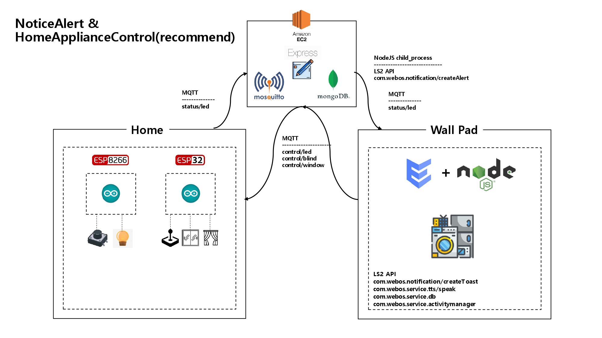

# NoticeAlert

<br>

## 소개

가전제어 기능과 아파트 내 사람들과 소통을 위한 아파트 게시판으로 이루어 져있다.<br> 
가전제어와 같은 경우에는 이미 최신 월패드에는 탑재되어 있으며 창문, 조명 제어에 블라인드 제어 기능을 더해서 월패드로 간편하게 조작할 수 있도록 했으며, 가전제어 기능과 연동되는 게시판 기능도 추가하였다. 공지 게시판에 작성된 글은 알림이 떠서 공지를 놓치지 않도록 한다. 또한 거주자끼리 소통할 수 있는 일반 게시판을 만들어 얼굴을 맞대고 이야기 하기 불편한 점들을 게시판을 통해 해소할 수 있게 한다.<br>

Home ++ 월패드의 가전제어 기능은 ESP8266(택트 스위치)나 ESP32(조이 스틱)을 통한 아날로그 제어와 enact의 MQTT 통신을 통한 디지털 제어를 동시에 할 수 있게 만들었다. 또한, 관리사무소에서 notice 게시판에 올리게 되고, 가전 제어 추천을 선택하면 알림과 함께 Alert를 통해서 가전 제어 추천을 할 수 있습니다. 그리고 사용자는 추천에 대해서 Yes와 No를 통해서 가전제어를 쉽게 할 수 있습니다.<br><br>


## System Architecture


<br><br>

## Flow Chart


<br><br>

## 기술 소개

AWS EC2(클라우드 서버):
- 보안 그룹의 인바운드 규칙에서 8080포트를 개방하여 포트 포워딩을 하였다. <br><br>
- Express.js(게시판 서버)
    - 공지용 Notice 게시판과, 아파트 주민 전용 General 게시판이 존재한다.
    - 각각 비밀번호(Notice, General)을 입력해야 게시물을 등록할 수 있게 하였고, 공지용 게시판 같은 경우에는 게시물을 등록함과 동시에 모든 wallpad, 즉 __post/notice__ topic을 subscribe하고 있는 wallpad에 __com.webos.notification/createToast__ 알림과 __com.webos.service.tts/speak__ 알림이 동시에 가게 되어있다.
    - 만약 공지를 등록할 때, 가전제어 추천 기능을 사용하면, 사용자에게 어떠한 이유로 어떤 가전제어를 언제부터 언제까지 이렇게 제어를 추천하겠다라는 __com.webos.notification/createAlert__ 알림을 통해 제어를 추천하고, 사용자가 yes를 누르면 해당 가전제어가 스케쥴링 되는 구조로 만들었다.
    <!-- 다영 누나가 한번 보고 첨삭해줘요. -->
<br>

webOS(월패드) - 2.18.0:
- ENACT(com.control.app)
    - LED 제어에 있어서는 현재 LED의 상태를 아는 것이 중요하기 때문에, LED의 상태를 맨 처음, useEFFECT를 통해서 init service를 가져오는 것으로 ESP8266에 정보를 요청해서 가져오고, 그 이후에는 각종 가전제어를 실행시키고 callback으로 subscribe Service를 실행시키는 방법을 사용했다.
    <br><br>
    <!-- 세윤누나가 한번 보고 첨삭해줘요. -->
- Node.JS(com.control.app.service)
    - init service: 맨 처음만 실행되는 서비스로, 해당 서비스가 실행되면 __init/led__ topic으로 요청을 보내서 ESP8266으로부터 현재 LED의 상태를 __status/led__ 를 subscribe하여 제공받습니다.
    - led service: enact로부터 넘겨받은 데이터를 parsing하여 __control/led__ topic에 보내 led를 제어합니다.
    - blind service: enact로부터 넘겨받은 데이터를 parsing하여 __control/blind__ topic에 보내 blind를 5단계로 제어합니다.
    - window service: enact로부터 넘겨받은 데이터를 parsing하여 __control/window__ topic에 보내 window를 5단계로 제어합니다.
    - subscribe service: __status/led__ topic을 subscribe하여 ESP8266으로부터 넘어온 LED 상태 정보를 enact에 계속 전달해주어 led상태를 실시간 반영하는데 사용된다. 또한 서비스가 쌓이는 것을 방지하기 위해 __control/*__ topic에 데이터가 들어오면 서비스를 취소한다.
<br>

webOS(월패드) - 2.17.0:
- ENACT(com.reservation.app)
    - 현재는 버튼만 있는 UI지만 나중에 __com.webos.service.activitymanager__ 가 2.18.0 버젼에서 작동한다면 위의 웹앱과 합칠 예정이다.
    <br><br>
    <!-- 세윤누나가 한번 보고 첨삭해줘요. -->
- Node.JS(com.control.app.service)
    - child service: __post/notice__ topic에서 가전제어 추천과 관련된 데이터가 들어오면, 데이터를 알맞게 parsing하여 node 기본 모듈인 Child Process를 사용하여 __com.webos.notification/createAlert__ 를 실행시킨다. 그렇게 실행된 Alert에서 사용자는 추천된 가전제어를 실행할지 안할지를 결정하게 되고 실행한다라고 하면, __control service__ 를 실행한다.
    - control service: child service에서 들어온 데이터를 parsing하여 추천된 가전제어를 __com.webos.service.activitymanager__ 의 create 메소드를 사용하여 reservation service를 예약된 시간에 실행되게 한다.
    - reservation service: 각각의 가전제어 topic에 데이터를 publish하여 가전을 직접 제어한다.
    
<br>

Arduino(현관):
- ESP8266(LED)
    - tact 스위치를 통해 스위치가 눌러졌다 떨어지는 그 순간에 LED를 제어하고 __status/led__ topic에 publish한다. 또한, __control/led__ 에 데이터가 들어오면 그에 맞게 LED 3개를 각각 제어한다.
- ESP32(Blind, Window)
    - JoyStick을 통해 좌우로는 window를 제어하고, 상하로는 blind를 step motor로 제어하는 방식을 사용했다. 그리고 __control/window__ , __control/blind__ topic에 데이터가 들어오면 맵핑 된 스텝을 기반으로 5단계 중 들어온 데이터에 해당하는 위치로 정확히 이동한다.
<br><br>

## 개발환경 및 개발언어
- 운영체제 : Windows 11, Ubuntu 20.04.5 LTS, webOS 2.18.0, webOS 2.17.0
- 디바이스 구성 : Raspberry Pi 4B 2EA
- IDE : Visual Studio Code, Arduino IDE
- 개발 언어 : ENACT, Node.JS, Arduino
- package manager : npm, yarn
<br><br>

<!-- ## Customize

<br> -->

## Quick Start
ares-setup-device에서 default를 자신이 설치할 webOS(2.18.0)의 IP로 설정하세요.
```bash
source wallpad1.setup.sh
```

ares-setup-device에서 default를 자신이 설치할 webOS(2.17.0)의 IP로 설정하세요.
```bash
source wallpad2.setup.sh
```
<br>

## 장애 요인

1. webOS 2.18.0에서 com.webos.service.createActivity LS2 API가 사용되지 않는 버그가 있다.<br>
--> 해당 버그를 해결하면 2.17.0으로 사용하던 reservation app을 control app으로 합칠 계획이다.
2. com.webos.notification/createAlert와 같은 경우에는 3rd party 앱에서는 권한 오류가 난다. <br>
--> 이를 해결하기 위해 node의 기본 모듈인 Child Process를 통해 luna-send로 직접 사용하게 되었다.
3. enact에서 subscribe 옵션을 통해 js_service를 실행하면, 단발적으로가 아닌 msg.respond를 통해 계속 데이터를 보내면 계속 callback을 실행시킬 수 있다. 하지만 해당 subscribe는 다른 서비스를 실행하는 순간 끊기게 되는 문제가 있었다.<br>
--> 다른 서비스가 실행되고, 끝나는 순간 바로 다시 subscribe 옵션을 통해 서비스를 불러오는 방식을 통해서 LED의 상태 변화를 계속 반영시켜줄 수 있었다.